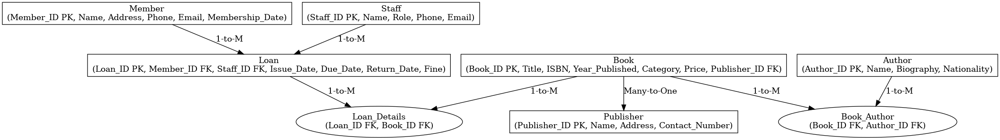

# Library Database Management System

A web-based application to manage a library's books, members, and loans, built with Python and Django.

## Features

*   **Book Management:** Add, edit, delete, and search for books in the library's collection.
*   **Author and Publisher Management:** Manage author and publisher information.
*   **Member Management:** Register, edit, and delete library members.
*   **Loan Management:** Track book loans, returns, and calculate fines for overdue books.
*   **User Roles:**  Separate roles for staff and members with different permissions.
*   **Sorting:** Sort books by name in ascending or descending order.
*   **Pagination:** Paginated lists for books.

## Tech Stack

*   **Backend:** Python, Django
*   **Database:** SQLite

## Entity-Relationship Diagram



## Project Structure

```
/home/rohitkumar/gemini_projects/Library Database management system/
├───.gitignore
├───BRD.md
├───db.sqlite3
├───EPICS.md
├───GEMINI.md
├───library_er_diagram.png
├───manage.py
├───README.md
├───requirements.txt
├───.gemini/
├───.git/...
├───.github/
│   └───workflows/
│       ├───gemini-dispatch.yml
│       └───gemini-invoke.yml
├───library/
│   ├───__init__.py
│   ├───admin.py
│   ├───apps.py
│   ├───models.py
│   ├───tests.py
│   ├───urls.py
│   ├───views.py
│   ├───__pycache__/
│   ├───migrations/
│   │   ├───__init__.py
│   │   ├───0001_initial.py
│   │   ├───0002_populate_data.py
│   │   ├───0003_add_more_ancient_indian_history_books.py
│   │   └───__pycache__/
│   └───templates/
│       └───library/
│           ├───author_detail.html
│           ├───author_list.html
│           ├───base.html
│           ├───book_detail.html
│           ├───book_list.html
│           ├───index.html
│           ├───loan_detail.html
│           ├───loan_list.html
│           ├───member_detail.html
│           └───member_list.html
├───library_management/
│   ├───__init__.py
│   ├───asgi.py
│   ├───Context.md
│   ├───settings.py
│   ├───urls.py
│   ├───wsgi.py
│   └───__pycache__/
└───venv/
    ├───bin/...
    ├───include/...
    ├───lib/...
    └───share/...
```

## Getting Started

### Prerequisites

*   Python 3.x
*   pip

### Installation

1.  **Clone the repository:**

    ```bash
    git clone https://github.com/your-username/library-database-management-system.git
    cd library-database-management-system
    ```

2.  **Create and activate a virtual environment:**

    ```bash
    python3 -m venv venv
    source venv/bin/activate
    ```

3.  **Install the dependencies:**

    ```bash
    pip install -r requirements.txt
    ```

4.  **Run the database migrations:**

    ```bash
    python manage.py migrate
    ```

5.  **Create a superuser to access the admin panel:**

    ```bash
    python manage.py createsuperuser
    ```

6.  **Run the development server:**

    ```bash
    python manage.py runserver
    ```

    The application will be available at `http://127.0.0.1:8000/`.

## Usage

*   Access the admin panel at `http://127.0.0.1:8000/admin/` to manage books, authors, members, and loans.
*   The main application is available at `http://12-7.0.0.1:8000/library/`.